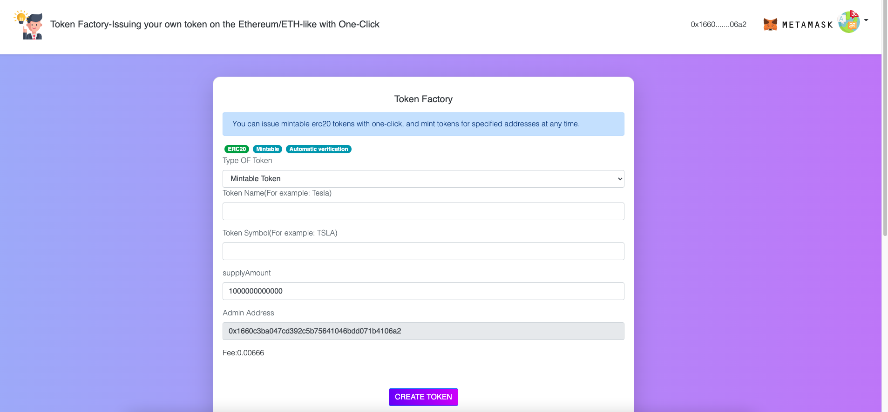

## TokenFactory
Issuing your own cryptocurrency token on the Ethereum,Binance and all EVM Blockchain with One-Click.
Support Mintable,Pausable,Capped,Burnable,USDT and multi Function ERC20 Tokens,BEP20 token.Create Token,Generate Token Defi DAPP

Support All the Ethereum EVM-compatible blockchains:
You can deploy these token to any Ethereum Virtual Machine Blockchain, like: Ethereum,Binance,Polygon,Fantom,Avalanche,Thundercore,avax,Harmony,Moonriver,Ubiq,Arbitrum,Theta,Wegochain,Akroma,moonriver,Moonbeam,telos,cronos,celo...
And you could also deploy these token to any test network,like: Ropsten,Kovan,Rinkby and Binance testnet...

 

 

Website1: https://erc20tokenfactory.netlify.app 
Website2:https://CryptoDappRun.github.io/Token-Factory/ 

Tutorial Video: 
https://youtu.be/37eDqbnDKhI 

 

Support network:
https://algocryptodapp.github.io/Blockchain-To-Metamask/

イーサリアムERC20トークンのワンクリック発行 
การออกโทเค็น Ethereum ERC20 เพียงคลิกเดียว 
以太坊/以太坊相似 ERC20代币一键发币 
صدور نشانه های Ethereum ERC20 با یک کلیک

ERC20 token
### Support Language:
English
简体中文
русский
한국어
日本語
ไทย

فارسی

### Need Earn cryptocurrency?
1.Download this project,put to any web server. 
2.Open js/config.js 
3.Change the address to your own address,customize fee you will recieve. then start earn cryptocurrency! 

Tips 
After modifying the address, please refresh the website to visit after more than ten minutes, because the github cache or website may not have been changed, so the charging address is still the previous address. 
 

You can deployed this source to any server and change the brand name without my approve.

Bee sender Token Airdop:
https://github.com/CryptoDappRun/Bee-Sender

